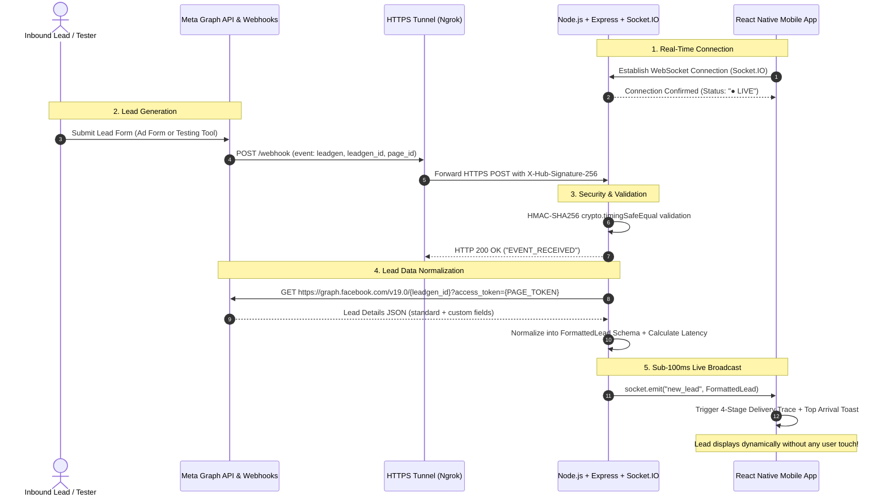

# 📋 Product Requirements Document (PRD)
## Project: Meta Lead Ads $\rightarrow$ React Native Live Sync PoC

---

## 1. Product Overview

The **Meta Lead Ads Real-Time Gateway & Mobile Client** provides a seamless, zero-touch bridge between customer form submissions on Meta platforms (Facebook / Instagram) and sales representatives using a mobile application.

```
┌────────────────────────┐      ┌────────────────────────┐      ┌────────────────────────┐      ┌────────────────────────┐
│  Meta Lead Ads / Tool  │ ───> │  Ngrok / HTTPS Tunnel  │ ───> │  Node.js + Socket.IO   │ ───> │  React Native Client   │
│   (Form Submission)    │      │      (Webhook POST)    │      │   (Backend Gateway)    │      │      (Live Feed)       │
└────────────────────────┘      └────────────────────────┘      └────────────────────────┘      └────────────────────────┘
```

---

## 2. Architecture & Data Flow



---

## 3. Core Functional Modules

### Module 1: Webhook Ingestion & Graph API Gateway (`backend/`)
- **`GET /webhook` (Handshake Verification):**
  - Validates `hub.mode === 'subscribe'` and `hub.verify_token === META_VERIFY_TOKEN`.
  - Returns `hub.challenge` with `200 OK`.
- **`POST /webhook` (Event Ingestion):**
  - Validates raw payload against `X-Hub-Signature-256` header using `crypto.timingSafeEqual`.
  - Extracts `leadgen_id`, checks in-memory deduplication set, and records start timestamp.
  - Queries Meta Graph API (`GET /v19.0/{leadgen_id}`) using `META_PAGE_ACCESS_TOKEN`.
  - Normalizes dynamic fields (Name, Email, Phone, Company, Custom Questions) and broadcasts via WebSockets.
- **Failover & Developer Simulation (`POST /api/simulate-lead` & `simulate_webhook.ts`):**
  - Enables local testing with authentic HMAC verification and diverse profile cycling.

### Module 2: WebSocket Real-Time Layer (`Socket.IO`)
- Bidirectional transport with auto-reconnection and heartbeat monitoring.
- Emits structured events:
  - `new_lead`: Broadcasts full lead payload with millisecond telemetry.
  - `lead_status_updated`: Synchronizes status changes across connected devices.
  - `system_activity`: Emits real-time backend pipeline logs to mobile activity stream.

### Module 3: React Native Mobile Client (`mobile/`)
- **Live Feed Interface:**
  - Dynamic `FlatList` with `React.memo` optimization maintaining 60 FPS under load.
  - Animated 4-stage **Delivery Trace** (`Meta Event` $\rightarrow$ `HMAC Valid` $\rightarrow$ `Graph API` $\rightarrow$ `Delivered Live`).
  - **Live Arrival Toast Banner** (`LiveToastAlert.tsx`) sliding down smoothly on inbound leads.
- **Speed-to-Lead Response Tracker:**
  - Interactive status workflow: `New Lead` $\rightarrow$ `Contacted` $\rightarrow$ `Qualified` $\rightarrow$ `Closed`.
  - Automatically calculates and timestamps first-contact response speed.
- **Quick Action Bar & Detail Sheet:**
  - One-tap triggers for **Call**, **SMS**, and **Email**.
  - Internal sales notes editor with instant save.
  - Deep-dive Technical Inspector displaying HMAC proof, latency breakdown, and raw Graph API JSON.

---

## 4. Normalized Data Model

```json
{
  "id": "lead_1787852558057",
  "leadgen_id": "10293847561234",
  "created_time": "2026-08-27T17:45:00.000Z",
  "full_name": "Rohan Mehta",
  "email": "rohan.mehta@example.com",
  "phone_number": "+91 9840550427",
  "city": "Bengaluru",
  "company_name": "Nova Cloud Systems",
  "form_name": "Enterprise Inbound Lead Form",
  "custom_fields": {
    "Interested Service": "Enterprise Cloud Migration",
    "Budget Estimate": "$25,000 - $40,000",
    "Preferred Contact Time": "Morning (9 AM - 12 PM)"
  },
  "status": "new",
  "telemetry": {
    "webhook_received_at": "2026-08-27T17:45:01.100Z",
    "graph_api_fetched_at": "2026-08-27T17:45:01.145Z",
    "broadcast_at": "2026-08-27T17:45:01.162Z",
    "pipeline_latency_ms": 62,
    "hmac_verified": true,
    "duplicate_protected": true
  },
  "received_at": "2026-08-27T17:45:01.162Z"
}
```

---

## 5. Security & Engineering Best Practices

1. **Timing-Safe Cryptography:** Uses `crypto.timingSafeEqual` with byte-length validation on raw body byte buffers to prevent timing analysis attack vectors.
2. **Memory Leak Protection:** All timeout and interval refs (`timersRef`) are cleared on unmount.
3. **Graceful Process Termination:** Handlers for `SIGTERM` and `SIGINT` cleanly close HTTP and WebSocket servers without dropping active socket sessions.
