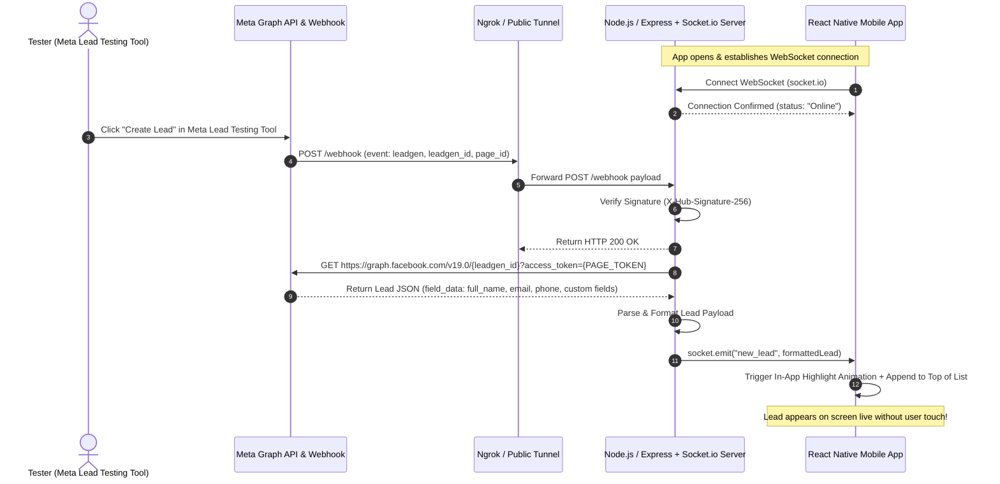

# Product Requirements Document (PRD)
## Project: Meta Lead Ads $\rightarrow$ React Native Live Sync PoC

---

## 1. Product Overview
The system captures lead generation events from Meta Lead Ads via Webhook, fetches complete lead details via Meta Graph API, and instantly broadcasts them to a connected React Native app over WebSockets (`Socket.io`). The lead displays dynamically on the active mobile screen with zero user interaction.

---

## 2. Architecture & Data Flow



---

## 3. Key Functional Modules

### Module 1: Webhook Ingestion & Graph API Gateway (Backend)
- **Endpoint `GET /webhook`:** 
  - Challenge verification (`hub.mode === 'subscribe'` & `hub.verify_token === VERIFY_TOKEN`).
  - Returns `hub.challenge` with `200 OK`.
- **Endpoint `POST /webhook`:**
  - Validates `x-hub-signature-256` using HMAC SHA256 with Meta App Secret.
  - Extracts `leadgen_id` and `page_id` from `entry[].changes[].value`.
  - Queries Graph API `GET /{leadgen_id}` with `PAGE_ACCESS_TOKEN`.
  - Emits normalized JSON payload to connected socket room.
- **Endpoint `POST /api/simulate-lead` (Mock / Fallback mode):**
  - Allows instant local testing without needing active Meta credentials.

### Module 2: Real-time Communication Layer (Socket.io)
- WebSocket server with heartbeat & auto-reconnection events (`connect`, `disconnect`, `reconnect`).
- Broadcast event `new_lead` with structure:
```json
{
  "id": "1234567890",
  "leadgen_id": "4567891230",
  "created_time": "2026-08-27T08:30:00Z",
  "full_name": "Sachin Sharma",
  "email": "sachin.lead@example.com",
  "phone_number": "+91 9876543210",
  "platform": "fb",
  "form_name": "Summer Special Consultation",
  "custom_fields": {
    "preferred_time": "Evening (6 PM - 8 PM)",
    "budget": "$10,000"
  },
  "is_new": true
}
```

### Module 3: React Native Client App (Clean Minimalist White Design)
- **Design System:**
  - Color palette: Clean White background (`#FFFFFF`), Soft Slate Gray borders (`#F1F5F9`), Charcoal headings (`#0F172A`), Emerald Green live indicator (`#10B981`), Indigo subtle accents (`#6366F1`).
  - Typography: Modern, high readability sans-serif with distinct weight hierarchy.
- **Components:**
  1. **Header Bar:** PoC Title + Live WebSocket Status Pill (🟢 Connected / 🔴 Reconnecting) + Lead Counter.
  2. **Lead Feed (FlatList / Animated):**
     - Smooth entry transition when new lead arrives.
     - "NEW" badge with subtle glow.
     - Contact details, timestamp, platform badge, form tag.
  3. **Lead Details Modal / Drawer:**
     - Click on card to view complete field mapping and payload metadata.
  4. **Direct Action Triggers:**
     - Quick "Call", "Email", and "Copy" actions directly from the card.

---

## 4. How to Shine Out (Differentiators & WOW Factors)
To make your submission standout against other candidates:
1. **Webhook Security (HMAC Validation):** Implement production-grade `X-Hub-Signature-256` verification so Meta webhooks are cryptographically authenticated.
2. **Audio-Visual Micro-interactions:** Play a subtle chime sound + light haptic/flash effect when a lead pops up on screen.
3. **Quick Action Buttons:** Directly trigger phone dialer or mail app from lead cards.
4. **Mock Lead Generator Button (Dual Mode):** Built-in "Simulate Test Lead" button in the backend or dev menu for rapid testing even without Meta webhook latency.
5. **Clean Architecture Separation:** Clean TypeScript structure separating API client, Socket Manager, UI hooks, and Theme tokens.
6. **Detailed Setup Guide & Video Script:** Complete ready-to-read script for your Loom recordings.

---

## 5. Agile Implementation Phases
* **Phase 1:** Backend Setup (Express + Socket.io + Meta Webhook & Graph API Gateway + Mock Simulator)
* **Phase 2:** React Native Mobile Client (Expo / RN + Clean White UI + Real-time Socket Listener + Animations)
* **Phase 3:** Meta Developer App & Ngrok Tunnel Setup + Lead Testing Tool Integration
* **Phase 4:** End-to-End Testing & Loom Video Presentation Kit (Step-by-step Script & Architecture Walkthrough)
