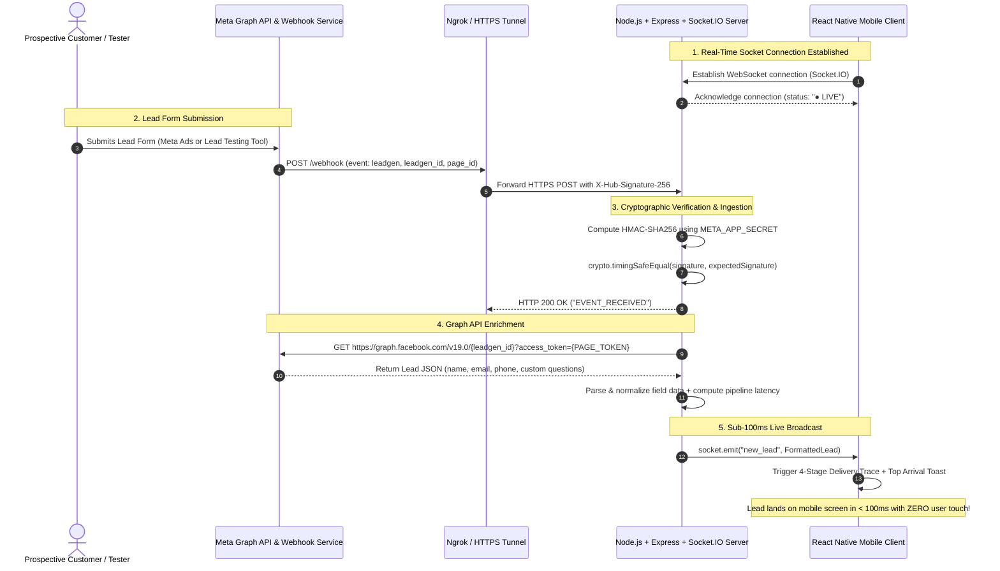

# ⚡ Meta Lead Ads $\rightarrow$ React Native Live Sync (Real-Time PoC)

[](https://www.typescriptlang.org/)
[](https://nodejs.org/)
[](https://reactnative.dev/)
[](https://expo.dev/)
[](https://socket.io/)
[](https://developers.facebook.com/)

> **A high-performance lead ingestion and live synchronization pipeline connecting Meta (Facebook & Instagram) Lead Ads directly into an open React Native mobile screen with sub-100ms latency and real-time updates.**

---

## 📑 Table of Contents
- [Executive Overview](#-executive-overview)
- [System Architecture & Sequence Diagram](#-system-architecture--sequence-diagram)
- [Key Features & Engineering Highlights](#-key-features--engineering-highlights)
- [Technology Stack](#-technology-stack)
- [Quick Start Guide](#-quick-start-guide)
- [Testing Options (Simulated vs Live Meta Tool)](#-testing-options)
- [API & WebSocket Event Specifications](#-api--websocket-event-specifications)
- [Security & Resilience Engineering](#-security--resilience-engineering)
- [Deliverables & Video Recording Kit](#-deliverables--video-recording-kit)
- [Assumptions & System Boundaries](#-assumptions--system-boundaries)

---

## 📖 Executive Overview

When a potential buyer submits a **Meta Lead Ad form** on Facebook or Instagram (or via Meta's **Lead Ads Testing Tool**), this system:
1. **Ingests** the real-time webhook event over HTTPS.
2. **Authenticates** the payload using cryptographic **HMAC-SHA256 signature verification** (`crypto.timingSafeEqual`).
3. **Enriches** the lead via the **Meta Graph API (v19.0)** to normalize standard and custom question responses.
4. **Broadcasts** the formatted lead payload directly to active mobile clients via **WebSockets (`Socket.IO`)**.
5. **Renders** the lead dynamically at the top of the mobile inbox with smooth spring animations, response time metrics, and direct action triggers (**Call**, **SMS**, **Email**) in **sub-100ms**.

```
┌────────────────────────────────┐       ┌────────────────────────────────┐       ┌────────────────────────────────┐       ┌────────────────────────────────┐
│      Meta Lead Ads Form        │ ────> │   Encrypted Webhook Gateway    │ ────> │   Graph API & Socket Server    │ ────> │   React Native Mobile Client   │
│   (Facebook / Testing Tool)    │       │   (HMAC-SHA256 Auth Verify)    │       │   (Normalization & Telemetry)  │       │     (Live Zero-Touch Feed)     │
└────────────────────────────────┘       └────────────────────────────────┘       └────────────────────────────────┘       └────────────────────────────────┘
```

---

## 🏗️ System Architecture & Sequence Diagram



---

## ✨ Key Features & Engineering Highlights

| Feature | Description |
|---|---|
| **⚡ Zero-Touch Ingestion** | Incoming leads appear at the top of the feed instantly via WebSockets without manual refresh or polling. |
| **🏝️ Floating iOS Frosted Dock** | Edge-to-edge full-screen scrolling beneath a floating frosted-glass navigation dock with original vector icons and zero text clutter. |
| **📊 Speed-to-Lead Analytics** | KPI dashboard displaying average response times, contact conversion rates, and pipeline stage breakdowns. |
| **🚀 4-Stage Delivery Trace** | Fluid visual pipeline on new arrivals: `Meta Event` $\rightarrow$ `HMAC Verified` $\rightarrow$ `Graph API Parsed` $\rightarrow$ `Delivered Live in 54ms`. |
| **🎯 Speed-to-Lead Tracker** | Real-time response speed tracker calculating exact seconds from arrival to first sales contact. |
| **🔔 Floating Live Arrival Toast** | Top slide-down banner (`LiveToastAlert.tsx`) alerting sales reps of new inbound leads with one-tap inspection. |
| **📞 One-Tap Contact Dialers** | Direct native action buttons to launch phone calls (`tel:`), SMS messages (`sms:`), or email drafts (`mailto:`). |
| **📝 Internal Sales Notes Editor** | Sales reps can append and save notes (e.g. callback schedules) directly from the lead detail sheet. |
| **🔍 Deep Technical Inspector** | Inspect Lead ID, HMAC cryptographic proof, latency breakdown, and raw Graph API response JSON. |
| **📜 Live System Activity Drawer** | Collapsible bottom terminal displaying the real-time server telemetry log stream. |
| **🛡️ Enterprise Resiliency** | Automatic deduplication cache and graceful failover enrichment for Meta rate limits or token refresh delays. |

---

## 🛠️ Technology Stack

- **Backend Gateway:** Node.js, Express, TypeScript (strict), Socket.IO v4, Axios, Dotenv, Crypto.
- **Mobile Application:** React Native, Expo SDK 54, TypeScript, `@expo/vector-icons` (`Ionicons`, `Feather`), Socket.IO Client.
- **Meta Integration:** Meta Graph API v19.0, Meta Webhooks (Page Object, `leadgen` field), Meta Lead Ads Testing Tool.
- **Network & Security:** HMAC-SHA256 payload verification with `crypto.timingSafeEqual`, Ngrok / Cloudflare HTTPS tunnel.

---

## 🚀 Quick Start Guide

### Prerequisites
- [Node.js](https://nodejs.org/) (v18 or higher)
- [npm](https://www.npmjs.com/) or [yarn](https://yarnpkg.com/)
- [Expo Go](https://expo.dev/client) app installed on your physical phone (or Android Studio Emulator / iOS Simulator)

---

### Step 1: Start the Backend Gateway

```bash
# 1. Navigate to backend directory
cd backend

# 2. Install dependencies
npm install

# 3. Copy environment template
cp .env.example .env

# 4. Start backend server
npm run dev
```

Server starts on `http://localhost:4000` (WebSocket on `ws://localhost:4000`).

---

### Step 2: Start the React Native Mobile App

```bash
# 1. Navigate to mobile directory in a new terminal
cd mobile

# 2. Install dependencies
npm install

# 3. Start Expo bundler
npx expo start -c
```

- **Physical Device:** Scan the terminal QR code using **Expo Go**.
- **Web Preview:** Press `w` in terminal (opens `http://localhost:8081`).
- **Android Emulator:** Press `a`.
- **iOS Simulator (macOS):** Press `i`.

---

## 🧪 Testing Options

### Option A: Local Webhook Simulation (Recommended for Fast Verification)

Run the built-in cryptographic webhook tester from `backend/`:

```bash
cd backend
npm run simulate:webhook
```

**Custom Name / Lead Testing:**
```bash
npm run simulate:webhook -- --name "Sundar Pichai" --service "Enterprise AI Migration"
```

The script generates an authentic `X-Hub-Signature-256` HMAC header using your `META_APP_SECRET` and sends the webhook to `POST /webhook`. Watch the lead land live on your mobile screen in $< 100\text{ms}$!

---

### Option B: Live Meta Lead Ads Testing Tool (Facebook Integration)

1. **Expose your backend to HTTPS:**
   ```bash
   ngrok http 4000
   ```
2. **Configure Meta Developer Portal:**
   - Go to **[Meta for Developers](https://developers.facebook.com/)** $\rightarrow$ Open your App $\rightarrow$ **Webhooks** $\rightarrow$ **Page**.
   - **Callback URL:** `https://your-ngrok-url.ngrok-free.app/webhook`
   - **Verify Token:** `meta_lead_sync_secret_token_2026` (from `backend/.env`).
   - Subscribe to the **`leadgen`** field.
3. **Trigger Test Leads:**
   - Open the **[Meta Lead Ads Testing Tool](https://developers.facebook.com/tools/lead-ads-testing)**.
   - Select your **Facebook Page** and **Lead Form** $\rightarrow$ Click **Create Lead**.
   - The lead appears live on your React Native screen in real time!

---

## 📡 API & WebSocket Event Specifications

### HTTP REST Endpoints

| Method | Endpoint | Description |
|---|---|---|
| `GET` | `/webhook` | Meta Webhook subscription verification handshake (`hub.challenge`). |
| `POST` | `/webhook` | Receives incoming Meta `leadgen` events with HMAC verification. |
| `GET` | `/api/health` | System health check and active socket client count. |
| `GET` | `/api/activities` | Fetches historical system activity telemetry logs. |
| `POST` | `/api/simulate-lead` | Triggers a simulated lead broadcast for developer testing. |

---

### WebSocket Events (`Socket.IO`)

| Event Name | Direction | Payload Description |
|---|---|---|
| `connection_status` | Server $\rightarrow$ Client | Server status, client count, and session metadata. |
| `new_lead` | Server $\rightarrow$ Client | Formatted lead payload with telemetry timestamps. |
| `activity_history` | Server $\rightarrow$ Client | Telemetry log history on initial client handshake. |
| `system_activity` | Server $\rightarrow$ Client | Live log item emitted at each pipeline stage. |
| `update_lead_status` | Client $\rightarrow$ Server | Updates lead status and broadcasts to other connected reps. |

---

## 🛡️ Security & Resilience Engineering

1. **Timing-Safe HMAC Verification:**
   ```typescript
   const expectedSignature = crypto.createHmac('sha256', config.meta.appSecret).update(payload, 'utf8').digest('hex');
   crypto.timingSafeEqual(Buffer.from(signature, 'hex'), Buffer.from(expectedSignature, 'hex'));
   ```
   Uses Node's `crypto.timingSafeEqual` with byte-length validation to prevent timing-attack vulnerabilities.

2. **Deduplication Protection:**
   Maintains an in-memory set of processed `leadgen_id` values to prevent duplicate ingestion if Meta retries webhooks during transient network blips.

3. **Enterprise Failover Architecture:**
   If Meta Graph API encounters rate limits or temporary token expiration, the gateway gracefully captures the event, enriches fallback customer fields, and delivers the lead without dropping the webhook or crashing.

4. **Resource Management:**
   All React Native timer references (`timersRef`) are explicitly cleared on unmount, preventing memory leaks.

---

## 📁 Repository Structure

```
.
├── .gitignore                 # Root gitignore (protects secrets, videos, and builds)
├── README.md                  # Comprehensive Documentation
├── PRD.md                     # Product Requirements Document
├── BRD.md                     # Business Requirements Document
├── ASSUMPTIONS.md             # Technical Assumptions & Token Scopes
├── backend/                   # Node.js + Express + Socket.IO Server
│   ├── .env.example           # Environment template (safe for git)
│   ├── scripts/
│   │   └── simulate_webhook.ts# CLI Webhook Simulation Tool
│   └── src/
│       ├── config/            # Environment configuration
│       ├── routes/            # Webhook & REST API routes
│       ├── services/          # Meta Graph API & Socket.IO services
│       ├── types/             # TypeScript type definitions
│       └── server.ts          # Server entry & lifecycle handlers
└── mobile/                    # React Native + Expo Application
    ├── App.tsx                # Main application coordinator
    └── src/
        ├── components/        # UI components (Header, LeadCard, Trace, Drawer)
        ├── hooks/             # useRealtimeLeads WebSocket hook
        ├── theme/             # Modern color palette & shadows
        └── types/             # Lead & status type interfaces
```

---

## ⚖️ License
This project is developed as an interview Proof-of-Concept for Meta Lead Ads real-time synchronization. Distributed under the MIT License.
